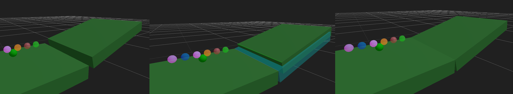

# 🏁 3D Marble Race Game

A complete 3D marble race game and track editor built with Three.js and Cannon.js physics engine. Create custom marble tracks, design unique marbles, and watch epic races unfold in real-time!

[DEMO](https://bake-ware.github.io/balls/balls.html)

  

## 🎮 Features


*Modern interface showing hierarchical object tree, toolbar, and 3D workspace with various track pieces and obstacles*

### 🏗️ Advanced Track Editor
- **🎛️ Modern Toolbar Interface**: Streamlined top toolbar with icon-based buttons and tooltips
- **📋 Tabbed Sidebar**: Left sidebar with "Objects" and "Add Pieces" tabs for better organization
- **🌳 Hierarchical Piece Selector**: Collapsible categories (Track Pieces, Obstacles, Physics Affectors, Lights & Effects, etc.)
- **Track Pieces**: Start platform, straight tracks, curves, end platform, pipes, half-pipes, quarter bowls  
- **Ball Sets**: Flexible marble starting positions - place and rotate starting line formations anywhere
- **Obstacles**: Pinned balls, pyramids, cylinders, cubes, prisms, custom .obj models
- **Physics Affectors**: Water zones, zero gravity, moon gravity, accelerators, brakes, ice surfaces
- **Camera Sets**: Marble-triggered camera control points with 4 follow modes and position capture
- **📋 Three-Level Object Tree**: Hierarchical organization (Main Type → Specific Type → Instances) with collapsible categories
- **🔀 Collapsible Sidebar**: Toggle sidebar visibility to maximize workspace with smooth animations
- **Multi-Selection**: Ctrl+click to select multiple pieces and transform them together


*Multi-selection system showing multiple objects selected with grouped transform controls*
- **🔄 Smart Duplication**: Duplicate button + Ctrl+drag to copy while moving
- **📦 Blueprint Export**: Export selected pieces as merged OBJ files for sharing track sections
- **Material Editor**: Customize color, transparency, metalness, roughness, glow effects, and textures
- **Custom Textures**: Upload your own textures with base64 encoding for portability
- **🎯 Advanced Transform Controls**: Move, rotate, and scale pieces with W/E/R hotkeys
- **🔗 Professional Edge Snapping**: Smart edge detection and alignment for all geometry types with S key
- **⚡ Stepwise Manipulation**: 1-unit step movement by default, hold Shift for 0.1-unit precision
- **⌨️ Keyboard Object Control**: Arrow keys, Space/C for precise object positioning in any transform mode
  - **Translate Mode**: ←/→ (X-axis), Space/C (Y-axis), ↑/↓ (Z-axis)
  - **Rotate Mode**: ←/→ (Yaw), Space/C (Roll), ↑/↓ (Pitch) 
  - **Scale Mode**: ←/→ (Width), Space/C (Height), ↑/↓ (Depth)
- **🖱️ Right-Click Context Menu**: Professional context menu with transform modes, properties, duplicate, delete, undo/redo


*Professional right-click context menu with transform modes, object properties, and editing options*
- **📊 Real-Time Dimensions Display**: Live dimensions readout showing actual object size in units
- **🎯 Smart Object Selection**: Improved selection behavior - no accidental deselection during drag operations
- **ViewCube Navigation**: 3D orientation cube with rotation arrows for quick orthographic view switching
- **Real-time Orientation**: ViewCube reflects current camera position with smooth transitions


*Advanced transform controls showing translate, rotate, and scale modes with precise object manipulation*

### 🔗 Advanced Edge Snapping System


*Basic edge snapping workflow showing blue hover detection, green source selection, and cyan preview alignment*


*Advanced edge snapping with curved geometry and complex track pieces showing connection point detection*


*Edge snapping working with curved tracks, pipes, and complex geometries with smart connection point analysis*

- **🔍 Smart Edge Detection**: Automatically detects edges on all geometry types - straight, curved, pipes, and complex shapes
- **🎯 Multiple Detection Methods**: Triangle-based edges for simple geometry, connection points for curves, bounding box edges for complex shapes
- **🌈 Visual Edge Highlighting**: 
  - **Blue hover**: Real-time edge detection while moving mouse
  - **Green selection**: Source edge (snap FROM) 
  - **Red selection**: Target edge (snap TO)
  - **Cyan preview**: Semi-transparent preview showing final alignment
- **⚡ Professional Precision**: Mathematical alignment with 45° rotation threshold to prevent excessive rotation
- **🎛️ Right-Side Control Panel**: Comprehensive settings panel with tolerance adjustment, preview toggle, and rotation alignment control
- **🖱️ Intuitive Workflow**: Hover to detect → Click source → Click target → Preview → Confirm
- **📐 Geometry Intelligence**: 
  - **Connection Edges**: Finds meaningful start/end points on curved tracks
  - **Boundary Edges**: Uses bounding box analysis for complex imported geometry  
  - **Triangle Edges**: Traditional edge detection for simple box/primitive geometry
- **🔧 Universal Compatibility**: Works with all track pieces, obstacles, custom models, and imported OBJ files
- **⌨️ Quick Access**: 'S' key shortcut, toolbar button (🔗), or right-click context menu
- **🎯 Smart Rotation**: Only rotates when alignment angle is ≤45° to prevent unwanted flipping

### 🖌️ Surface Painting System
- **🎨 Face-Level Painting**: Click individual faces on any 3D object to paint them with custom colors
- **Per-Face Material Control**: Each face can have unique color, transparency, metalness, roughness, and glow properties
- **🌈 Vertex Color System**: Advanced vertex coloring with full PBR material support
- **Real-time Visual Feedback**: Immediate color application with smooth transitions
- **🖌️ Dual Painting Modes**:
  - **Single Triangle**: Paint individual triangles with precise control
  - **Cascade (Adjacent Similar)**: Flood-fill painting that spreads to connected triangles with similar normals
- **🌊 Intelligent Flood-Fill Algorithm**: Paint cascades across connected surfaces, following curves and edges naturally
- **📐 Angle Threshold Control**: Adjustable angle tolerance (5°-90°) for cascade painting precision
- **🔗 Adjacency-Based Spreading**: Triangles must be physically adjacent (sharing an edge) to be included in cascade painting
- **Procedural Textures**: Apply polka dots, stripes, marble patterns, or upload custom textures to individual faces
- **🧽 Selective Clearing**: Clear all face paint from selected objects or start fresh anytime
- **Material Preservation**: Original object materials are preserved and can be restored


*Surface painting system showing individual face painting with custom colors and materials on a curved track piece*
- **Multi-Object Support**: Paint faces across different object types (track pieces, obstacles, custom models)
- **🎭 Creative Customization**: Create unique artistic designs, racing stripes, team colors, or decorative patterns
- **Precision Control**: Crosshair cursor for accurate face selection and painting
- **Undo Functionality**: Clear all paint button to reset objects to original appearance

### ⚽ Ball Maker & Advanced Placement System


*Ball Maker interface showing complete marble customization with color, materials, glow effects, and texture options*
- **Complete Customization**: Color, metalness, roughness, glow intensity, glow color
- **Procedural Textures**: Polka dots, stripes, marble patterns
- **Ball Roster**: Manage race participants with visual previews
- **🏁 Flexible Ball Placement**: Use Ball Set pieces to define starting positions anywhere on track
- **📍 Real-Time Visual Previews**: Ball Sets show semi-transparent previews of all roster balls in formation
- **🔄 Dynamic Multi-Position Spawning**: All roster balls spawn in line formations at each Ball Set location
- **⚙️ Rotational Control**: Rotate Ball Sets to orient starting lines in any direction
- **🎯 Distance-Based Lead Selection**: Camera follows the marble that has traveled furthest from its starting position
- **⚡ Same-Type Collision Switching**: When marbles of the same type touch, camera switches to the one that traveled further
- **🏃 Intelligent Ball Tracking**: Each marble tracks its type, starting position, and travel distance for advanced camera logic
- **Random Generation**: Create random balls with varied properties
- **Material Physics**: Realistic rendering with PBR materials

### 📹 Dynamic Camera System
- **5 Camera Modes**: 
  - **Panning**: Orbiting camera around lead marble
  - **FPV**: First-person view from marble perspective
  - **Behind**: Chase camera following behind the marble
  - **Ride Along**: Smooth tracking at diagonal offset
  - **Oncoming**: Camera positioned ahead looking back
- **📷 Camera Set Blocks**: Marble-triggered camera control points
  - **Static Mode**: Camera jumps to preset position and stays there
  - **Follow Mode**: Camera follows triggering marble from preset offset
  - **Rigid Mode**: Camera maintains exact offset with no smoothing
  - **Smooth Mode**: Camera smoothly interpolates to follow marble
  - **Trigger Zones**: Rectangular activation areas that marbles pass through
  - **Persistent Control**: Once activated, camera sets maintain control until overridden
  - **Position Capture**: Save current viewport camera position with one click
- **Smooth Transitions**: Cubic easing when switching between lead marbles
- **Manual Override**: User can take control with mouse/orbit controls or Camera button
- **Smart Reset**: Camera set control automatically resets when users manually change camera modes

### 📋 Advanced Object Management System


*Hierarchical object management system showing three-level organization with expandable categories and instance management*
- **📁 Three-Level Hierarchy**: Main Type → Specific Type → Individual Instances
  - **Track Pieces**: Start, straight, curve, end, pipe, half-pipe, quarter-bowl, ball-set
  - **Obstacles**: Ball, pyramid, cylinder, cube, prism
  - **Affector Zones**: Water, gravity, accelerator, brake, ice zones
  - **Lighting**: Spot lights, point lights, strobes, particle generators
  - **Camera System**: Camera set pieces for dynamic filming
  - **Custom**: Imported .obj files and other custom objects
- **🔍 Smart Organization**: Objects automatically categorized by type and function
- **📊 Instance Counting**: Shows quantity of each object type with real-time updates
- **🎯 Multi-Level Selection**: Click main categories, specific types, or individual instances
- **✏️ Custom Naming**: Double-click any object to give it a custom name
- **💾 Persistent Names**: Custom object names saved and loaded with track files
- **🔄 Collapsible Interface**: Each hierarchy level remembers its expansion state
- **🎨 Visual Feedback**: Selected objects highlighted across both tree and 3D scene
- **⌨️ Keyboard Integration**: Full support for Ctrl+click multi-selection
- **🔍 Type Filtering**: Easily find all instances of a specific piece type

### 🌌 Physics Affector Zones
- **💧 Water Zone**: Simulates buoyancy and water resistance
- **🌌 Zero Gravity**: Removes gravitational effects completely
- **🌙 Moon Gravity**: Reduced gravity simulation (1/6th Earth gravity)
- **⚡ Accelerator**: Speed boost zones for dramatic acceleration
- **🛑 Brake Zone**: Deceleration areas to slow down marbles
- **🧊 Ice Zone**: Ultra-low friction surfaces for sliding effects
- **Intensity Control**: Adjustable effect strength (0-10 scale)
- **Real-time Physics**: Effects applied continuously while marbles are in zones

### ⚙️ Advanced Pathing System
- **Path Recording**: Record keyframe positions for animated track pieces
- **Movement Types**: Translation, rotation, and scaling animations
- **Playback Modes**:
  - 🔄 **Loop**: Continuous repeating movement
  - 🔃 **Loop Reversible**: Back-and-forth oscillation
  - 👆 **Once on Touch**: Trigger animation when marble touches piece
  - ⏯️ **Manual Control**: User-activated animations
- **Speed Control**: Adjustable playback speed for perfect timing
- **Multi-point Paths**: Create complex movement sequences with multiple keyframes

### 🔧 Advanced Bend Tool System


*Advanced bend tool system showing right-side panel interface for geometric deformation of track pieces*
- **🌀 Geometric Deformation**: Bend track pieces and objects with precise mathematical control
- **🎛️ Right-Side Panel**: Professional slide-out panel design matching other tool interfaces
- **📐 Multi-Axis Bending**: Bend along X, Y, or Z axes with real-time preview
- **🎯 Adjustable Parameters**: Bend angle, center point, and falloff control for perfect curves
- **⚡ Live Updates**: Real-time physics and visual updates during bend operations
- **🔄 Reset Functionality**: Instantly restore original geometry when needed
- **⌨️ Quick Access**: B key shortcut or right-click context menu activation

### 🌌 Environment & Lighting System
- **Skybox Selector**: Procedural skyboxes (Sunset, Ocean, Space, Dawn)
- **Custom Upload**: Upload 360° panoramic images
- **Background Color Control**: Customizable world background color with real-time updates
- **Dynamic Lighting**: 4 light types (Spot, Point, Strobe, Directional) with real-time controls
- **Advanced Particle Systems**: 5 particle shapes (Point, Star, Square, Circle, Spark) and 5 themed types (Fire, Water, Electrical, Steam, Wind)
- **Bloom Post-Processing**: Enhanced particle effects with glowing materials and bloom rendering
- **Real-time Updates**: All lighting and particle settings update instantly without apply buttons
- **Environment Lighting**: Skyboxes affect scene lighting and reflections
- **Save Integration**: Skyboxes, lighting, and particle settings saved with track files

### 🏆 Tournament & Race Features


*Tournament mode interface showing multi-track management, marble roster, and competitive scoring system*
- **Tournament Mode**: Multi-track tournaments with automatic progression
- **Individual Track Loading**: Build tournaments by loading tracks one at a time
- **Comprehensive Scoring**: 3 points for 1st, 2 points for 2nd, 1 point for 3rd
- **Tournament Results**: Final leaderboard showing overall winners
- **Race Timing**: 30-second delay after first marble finishes before advancing
- **Real-time Physics**: Accurate marble physics with Cannon.js
- **Instant Results**: Race results appear immediately when first marble finishes
- **Dynamic Updates**: Results update live as more marbles finish
- **Ball Nameplates**: Floating name tags that always face the camera
- **Finish Detection**: Touch-based finish line detection with frame interpolation
- **Randomized Starting**: Marbles start in random positions each race

### 📋 Object Management & Export System
- **📜 Object Selection Tree**: Hierarchical list showing all scene objects with visual icons
- **🎯 Smart Selection**: Click to select single objects, Ctrl+click for multi-selection
- **✏️ Object Renaming**: Double-click tree items to give pieces custom names
- **🖱️ Draggable Panel**: Drag the tree panel by its header to position it anywhere on screen
- **🔄 Enhanced Duplication**: 
  - **📋 Duplicate Button**: Creates copies 2 units above originals with all properties
  - **⌨️ Ctrl+Drag**: Hold Ctrl while dragging to move copies instead of originals
- **📦 Blueprint Export**: Export selected pieces as merged OBJ files
  - **🎯 Relative Positioning**: All pieces positioned relative to selection center
  - **📝 Custom Naming**: Dialog for naming blueprint files before export
  - **🔗 Merged Geometry**: All selected objects combined into single OBJ object
  - **📊 Material Info**: Material properties preserved as comments in export
- **🔍 Object Information**: Tree shows piece types, special properties, and visual status
- **⚡ Real-time Updates**: Object tree updates automatically when objects are added/removed

### 💾 Save/Load System
- **Complete Persistence**: Tracks, materials, skyboxes, custom balls all saved
- **JSON Format**: Human-readable save files
- **Base64 Assets**: Textures and skyboxes embedded for portability
- **Backward Compatibility**: Supports loading older track formats

## 🚀 Getting Started

### Quick Start
1. Open `balls.html` in a modern web browser
2. Use the toolbar to add track pieces (Straight → Curve → End)
3. Add "🏁 Ball Set" pieces where you want marbles to start racing
4. Click "Start Race!" to begin (marbles will spawn at all Ball Set locations)
5. Use "Camera" button to cycle through viewing modes

### Track Building
1. **Modern Interface**: Use the streamlined top toolbar with icon-based buttons and helpful tooltips
2. **Add Pieces**: Click "Add Pieces" tab in left sidebar, then expand categories to select pieces to add
3. **Add Ball Sets**: Place "🏁 Ball Set" pieces where you want marbles to start
4. **Object Management**: Use "Objects" tab in left sidebar to view hierarchical object tree
5. **Sidebar Control**: Click ◀/▶ button to collapse/expand sidebar for maximum workspace
6. **Multi-Select**: Hold Ctrl and click pieces in tree or 3D view for multi-selection
7. **Smart Duplication**: Use toolbar "📋" button or Ctrl+drag to copy pieces
8. **Transform Controls**: Use toolbar "🎯" button or W/E/R hotkeys, Shift for grid snap
9. **Materials**: Select pieces and click toolbar "🎨" button to customize appearance
10. **Surface Painting**: Select any object and click toolbar "🖌️" button to paint individual faces
11. **Quick Access**: All essential tools available in top toolbar (Save 💾, Load 📂, Camera 📹, Balls ⚽, Tournament 🏁)
12. **Special Features**: Add affector zones, camera sets, lights, and particle effects from hierarchical selector
13. **Save**: Use toolbar "💾" button to export your complete track

### Ball Customization & Racing
1. **Ball Maker**: Click toolbar "⚽" button to design custom marbles
2. **Properties**: Adjust color, shine, glow, and texture patterns
3. **Ball Roster**: Click toolbar "👥" button to manage race participants
4. **Random Generation**: Use "Add Random" to generate varied marbles quickly
5. **Ball Placement**: Place "🏁 Ball Set" pieces anywhere on your track
6. **Preview System**: Ball Sets show transparent previews of all roster balls
7. **Dynamic Racing**: All roster balls spawn at each Ball Set location in line formation

### 🎛️ Modern Interface Overview
1. **Top Toolbar**: All essential tools in one streamlined bar with consistent gray styling
2. **Left Sidebar**: Tabbed interface with "Objects" tree and "Add Pieces" hierarchical selector
3. **Collapsible Design**: Click ◀/▶ to hide/show sidebar for maximum 3D workspace
4. **Icon-Based UI**: Clear, recognizable icons with descriptive tooltips on hover
5. **Unified Color Scheme**: Consistent visual design across all interface elements
6. **Race Mode Adaptation**: Toolbar buttons automatically show/hide based on current mode
7. **Selection Info Panel**: Bottom-right panel showing real-time selection details (count, position, rotation, scale)
8. **Responsive Layout**: Interface adapts smoothly between edit and race modes
9. **Quick Access**: Critical functions like Save, Load, Camera, Balls, Tournament always visible

### Racing
1. **Start Race**: Click "Start Race!" to begin simulation
2. **Camera Control**: Toggle between 5 different camera modes during race
3. **Results**: Results appear instantly when first marble finishes
4. **Restart**: Use "Restart Race" to run again with randomized starting positions

## 🛠️ Technical Details

### Built With
- **Three.js r165**: 3D rendering and graphics
- **Cannon-ES**: Physics simulation
- **WebGL**: Hardware-accelerated rendering
- **Canvas API**: Procedural texture generation
- **EffectComposer**: Post-processing pipeline for bloom effects
- **UnrealBloomPass**: Advanced particle glow rendering

### Architecture
- **Modular Design**: Separate systems for editor, physics, rendering, UI
- **Real-time Physics**: 60 FPS physics simulation with visual synchronization
- **Material System**: PBR (Physically Based Rendering) materials with custom shaders
- **Vertex Color System**: Advanced per-face painting with BufferGeometry vertex color attributes
- **Event-Driven**: Clean separation between UI interactions and game logic
- **Affector System**: Real-time physics modification zones with continuous effect application
- **Animation Engine**: Keyframe-based pathing system with multiple playback modes
- **Post-Processing Pipeline**: Bloom effects with emissive materials for enhanced visuals
- **Real-time UI Updates**: Instant feedback system without apply buttons for smooth editing
- **3D Navigation**: ViewCube with spherical coordinate camera positioning
- **Face-Level Rendering**: Individual face material control with raycasting for precise selection
- **Triangle Adjacency System**: Edge-based adjacency mapping for cascade painting and flood-fill algorithms

### Performance
- **SAP Broadphase**: Advanced collision detection algorithm for better performance
- **Optimized Physics**: Efficient collision detection using exact geometry
- **LOD System**: Adaptive detail based on viewing distance
- **Texture Caching**: Smart texture management and reuse
- **Memory Management**: Proper cleanup of physics bodies and materials
- **Zone Optimization**: Efficient affector zone detection and application

## 🎯 Advanced Features

### Multi-Selection System
```javascript
// Ctrl+click to select multiple pieces
// Transform controls automatically create group
// Relative positions maintained during transforms
```

### Custom Material Pipeline
```javascript
// Support for:
// - Base color and transparency
// - Metalness and roughness (PBR)
// - Emissive glow effects
// - Custom texture upload
// - Procedural pattern generation
```

### Physics Integration
```javascript
// Exact visual-to-physics matching
// Trimesh collision for complex geometry
// Real-time physics updates
// Finish line collision detection
```

## 📁 File Structure

```
balls/
├── balls.html              # Main application (complete game)
├── README.md               # This file
├── marble-track (20).json  # Example track save file
├── BookCovers0135_1_M.jpg  # Texture asset
├── moon_lab.jpg           # Skybox asset
└── book.*                 # 3D model assets
```

## 🎮 Controls

### Editor Mode
- **Top Toolbar**: Click icon buttons for quick access to all tools
- **Left Sidebar Tabs**: Switch between "Objects" tree and "Add Pieces" selector
- **Sidebar Toggle**: Click ◀/▶ button to collapse/expand sidebar
- **Mouse**: Click to select pieces (3D view or Object Tree)
- **Right-Click**: Context menu with transform modes, properties, duplicate, delete, undo/redo
- **Ctrl+Click**: Multi-select pieces (3D view or Object Tree)
- **Double-Click**: Rename pieces in Object Tree
- **Ctrl+Drag**: Duplicate and move copies of selected pieces
- **Transform Modes**: W (Move), E (Rotate), R (Scale) or use toolbar 🎯 button
- **S Key**: Toggle Edge Snap Tool for precise alignment or use toolbar 🔗 button  
- **B Key**: Toggle Bend Tool mode for geometric deformation
- **Del**: Delete selected pieces or use toolbar 🗑️ button

#### ⌨️ **Keyboard Object Manipulation** (requires selected object):
- **Default Movement**: 1-unit steps (hold Shift for 0.1-unit precision)
- **Translate Mode**: ←/→ (X-axis), Space/C (Y-axis), ↑/↓ (Z-axis)
- **Rotate Mode**: ←/→ (Yaw), Space/C (Roll), ↑/↓ (Pitch) with 15°/1° steps
- **Scale Mode**: ←/→ (Width), Space/C (Height), ↑/↓ (Depth) with 0.1/0.01 steps

#### 🖱️ **Mouse Controls**:
- **Mouse Drag**: Transform selected pieces (with smart selection - no accidental deselection)
- **Middle Mouse**: Pan camera
- **Scroll**: Zoom camera
- **Tooltips**: Hover over toolbar buttons for descriptions

### Edge Snapping Mode
- **🔗 Edge Snap Button**: Activate edge snapping mode (S key) or use toolbar/context menu
- **Blue Hover Highlighting**: Move mouse over objects to see edge detection in real-time
- **Two-Click Workflow**: 
  1. **Click source edge** (highlighted in green) - the edge you want to move FROM
  2. **Click target edge** (highlighted in red) - the edge you want to snap TO
- **Preview Confirmation**: Semi-transparent cyan preview shows final alignment (if enabled)
- **Click to Confirm**: Click anywhere to confirm the snap, or select new edges to cancel
- **⚙️ Panel Controls**:
  - **Detection Tolerance**: Adjust how close you need to click to detect edges (0.1-2.0 units)
  - **Show Preview**: Toggle preview mode on/off for immediate vs. confirmed snapping
  - **Align Rotation**: Enable/disable automatic rotation alignment (45° threshold)
- **🎯 Smart Detection**: Automatically finds the best edges for different geometry types
- **🔄 Easy Reset**: Clear Selection button to start over, Close to exit edge snap mode

### Surface Painting Mode
- **🖌️ Face Paint Button**: Activate face painting mode (select object first)
- **Paint Mode Selection**: Choose between Single Triangle or Cascade (Adjacent Similar) modes
- **Mouse Click**: Paint faces with current paint settings
  - **Single Mode**: Paints only the clicked triangle
  - **Cascade Mode**: Flood-fills to adjacent triangles with similar normals within angle threshold
- **📐 Angle Threshold Slider**: Adjust cascade painting sensitivity (5°-90°) when in cascade mode
- **Crosshair Cursor**: Precise face selection targeting
- **🗑️ Clear All**: Remove all face paint from selected object
- **❌ Close**: Exit face painting mode and re-enable transform controls

### Race Mode
- **Camera Button**: Cycle through camera modes
- **Middle Mouse**: Pan during race (when enabled)
- **Mouse Drag**: Manual camera control (overrides auto-camera)

## 🎨 Customization Examples

### Creating a Glow Ball
1. Open Ball Maker
2. Set bright color (e.g., cyan #00ffff)
3. Increase glow intensity to 0.8
4. Set glow color to white #ffffff
5. Choose metalness 0.9 for extra shine

### Building a Loop Track
1. Add Start platform
2. Add Straight pieces to build up
3. Add Pipe pieces for the loop
4. Use material editor to make pipes transparent
5. Add End platform after loop

### Creating Perfectly Aligned Track Sections with Edge Snapping
1. Enable Edge Snap mode (S key or 🔗 toolbar button)
2. Place your first track piece where you want it
3. Add a second piece nearby (don't worry about exact positioning)
4. Hover over the first piece's edge where you want to connect - you'll see blue highlighting
5. Click the connection edge (it turns green) - this is your source edge
6. Hover over the second piece's edge that should connect - blue highlighting appears
7. Click the target edge (it turns red) - this creates the connection
8. If preview is enabled, you'll see a cyan preview of the final position
9. Click anywhere to confirm the snap - pieces align perfectly!
10. Repeat for complex track layouts with curves, pipes, and mixed geometry types
11. Perfect for creating smooth flowing tracks where marbles won't get stuck

### Creating Custom Surface Designs with Face Painting
1. Select any track piece or obstacle you want to customize
2. Click "🖌️ Face Paint" to open the Surface Painting panel
3. Choose your paint mode:
   - **Single Triangle**: For precise, individual face control
   - **Cascade (Adjacent Similar)**: For painting entire surfaces or sides
4. If using Cascade mode, adjust the angle threshold (5°-90°) to control how far the paint spreads
5. Choose your paint color and adjust transparency, metalness, roughness
6. Set glow intensity and glow color for emissive effects
7. Select texture type: None, Upload Custom, Polka Dots, Stripes, or Marble
8. Click on faces to apply your custom paint:
   - **Single mode**: Paints only the clicked triangle
   - **Cascade mode**: Paint spreads to all connected triangles with similar orientations
9. Each face can have completely different materials and colors
10. Use "🗑️ Clear All" to reset the object to its original appearance
11. Perfect for creating racing stripes, team colors, curved surface designs, or artistic patterns

### Night Race Scene with Lighting Effects
1. Open Skybox Selector and choose "Space" skybox
2. Add Spot Lights along the track for dramatic lighting
3. Add Particle Generators with "Fire" type for ambient effects
4. Set track pieces to have glow materials
5. Create glowing balls for visibility
6. Use Strobe Lights for exciting race atmosphere
7. Start race for cosmic marble action!

### Creating Dynamic Particle Effects
1. Add a Particle Generator from the piece selector
2. Select the generator and open Object Editor
3. Choose "Electrical" type for sparking effects
4. Adjust particle count to 500 for density
5. Set "Spark" shape for realistic electrical look
6. Combine with Point Lights for enhanced illumination

### Custom Environment Setup
1. Open Lighting controls
2. Set custom Background Color (e.g., deep blue #001122)
3. Adjust Ambient and Directional light intensity
4. Add multiple light sources for complex shadows
5. Use ViewCube to check lighting from all angles

### Creating Cinematic Camera Sequences
1. Add Camera Set pieces from "Camera Controls" section
2. Position camera sets along the track where you want dramatic views
3. Select each camera set and click "📸 Capture Current Camera Position"
4. Choose follow modes: Static for fixed shots, Follow for dynamic tracking
5. Test during races - marbles trigger camera changes as they pass through
6. Use multiple camera sets to create complex filming sequences

### Advanced Object Management
1. Open "📋 Object Tree" panel to see all scene objects
2. Click object names to select them instantly
3. Ctrl+click multiple objects for batch operations
4. Use "📋 Duplicate" to copy with all properties preserved
5. Hold Ctrl while dragging to move copies instead of originals
6. Select multiple pieces and use "📦 Export Blueprint" to save as OBJ file

### Creating Reusable Track Sections
1. Build a track section (e.g., spiral loop, jump ramp, tunnel)
2. Select all pieces using Object Tree or Ctrl+click in 3D view
3. Click "📦 Export Blueprint" button (appears when multiple pieces selected)
4. Name your blueprint (e.g., "spiral_loop", "mega_jump")
5. Share the OBJ file with others or import into 3D modeling software
6. Use exported blueprints as reference for rebuilding complex sections

### Flexible Racing Setup
1. Delete old Start platform pieces (no longer needed)
2. Add "🏁 Ball Set" pieces from the piece selector
3. Position Ball Sets anywhere on your track - multiple start points supported
4. Rotate Ball Sets to orient starting line formations in any direction
5. Ball Sets show transparent previews of all roster marbles
6. During races, all marbles spawn in neat lines at each Ball Set location
7. Great for creating multi-stage races, parallel tracks, or elimination rounds

### Advanced Object Organization
1. Open "📋 Object Tree" panel to see all scene objects organized hierarchically
2. Expand main categories like "Track Pieces" to see all track-related objects
3. Expand specific types like "Straight" to see all individual straight pieces
4. Click any object in the tree to select it instantly in the 3D scene
5. Double-click objects to rename them with custom names
6. Use Ctrl+click to multi-select objects of different types
7. Each level remembers its expansion state for persistent organization
8. Perfect for managing complex tracks with hundreds of objects

## 🐛 Troubleshooting

### Performance Issues
- Reduce number of marbles in roster
- Use simpler track designs
- Disable glow effects on materials
- Close other browser tabs

### Physics Problems
- Ensure track pieces are connected properly
- Check for overlapping geometry
- Verify Ball Set pieces are placed where you want marbles to start
- Use "Edit Material" to adjust piece materials
- Check Object Tree to identify and fix problematic pieces

### Saving/Loading
- Ensure browser allows file downloads
- Large custom textures may increase file size
- Check console for any error messages

## 🤝 Contributing

This is a complete, self-contained marble race game. The entire application is in `balls.html` for easy sharing and modification.

### Development
- Edit `balls.html` directly
- Use browser dev tools for debugging
- Test physics changes carefully
- Maintain backward compatibility for save files

## 📄 License

This project is open source. Feel free to modify and share!

## 🎉 Credits

Created with advanced 3D graphics and physics simulation. Features professional-grade track editing, material systems, and racing mechanics.

**Technologies:**
- Three.js for 3D rendering
- Cannon-ES for physics simulation
- Modern WebGL and Canvas APIs
- Advanced mathematical algorithms for smooth camera transitions

---

*🤖 Generated with [Claude Code](https://claude.ai/code)*

*Co-Authored-By: Claude <noreply@anthropic.com>*
